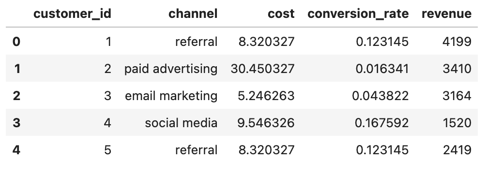
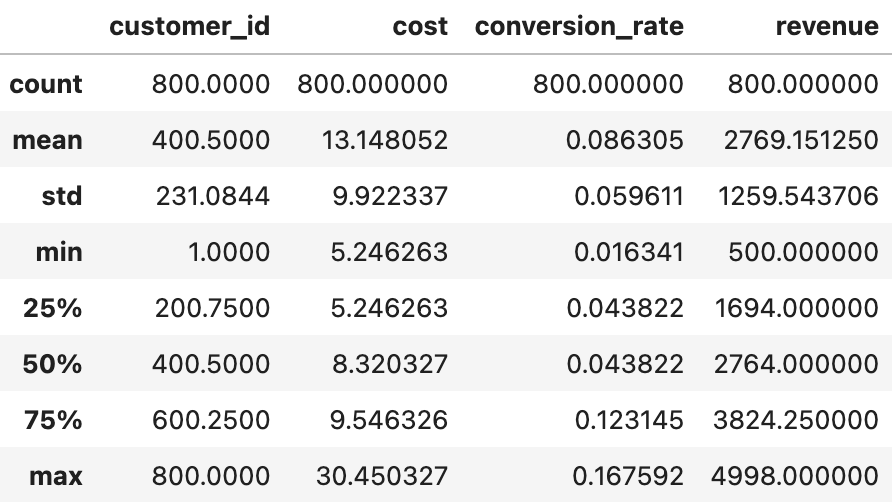
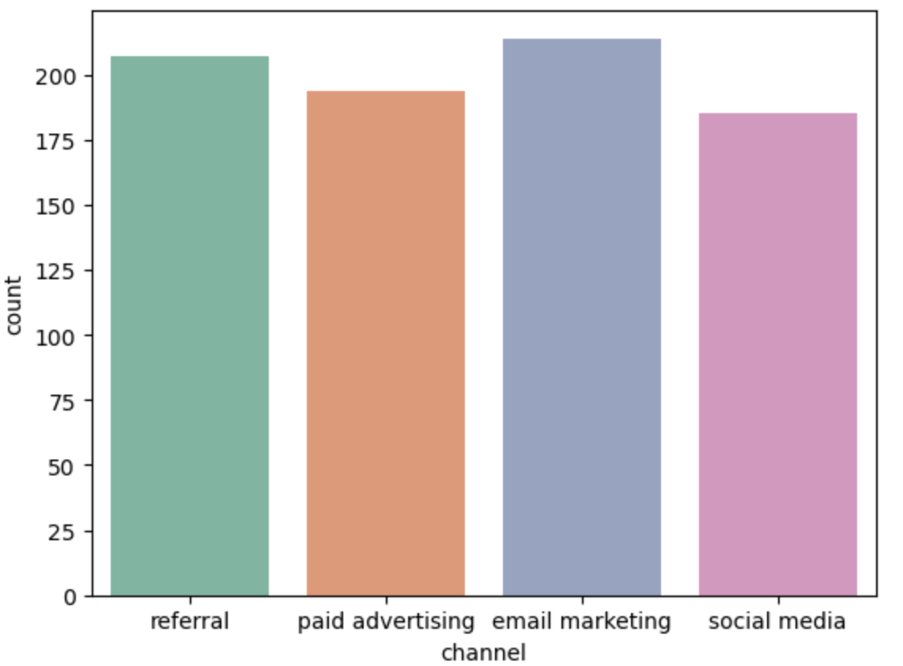
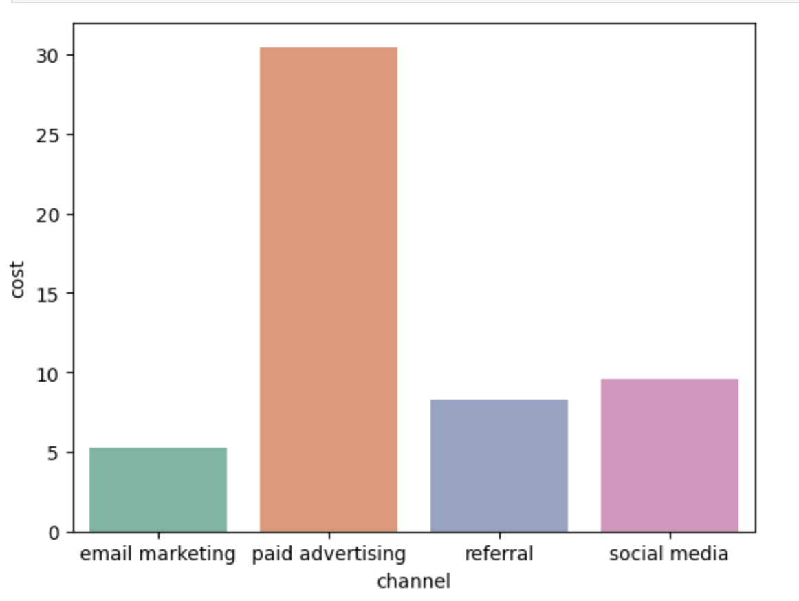
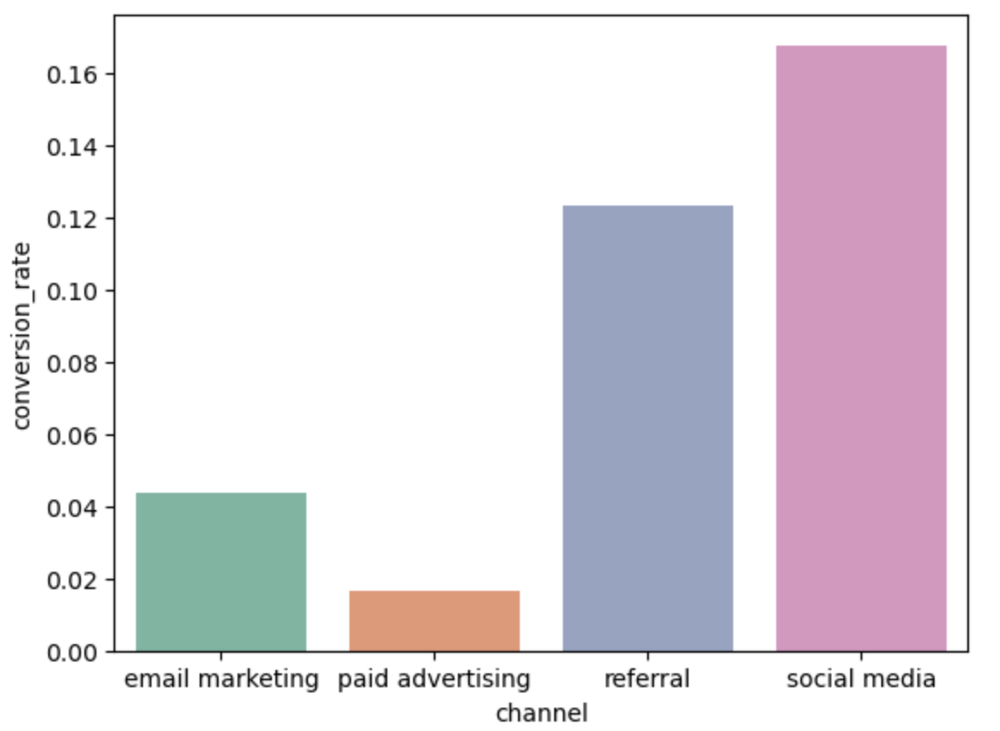
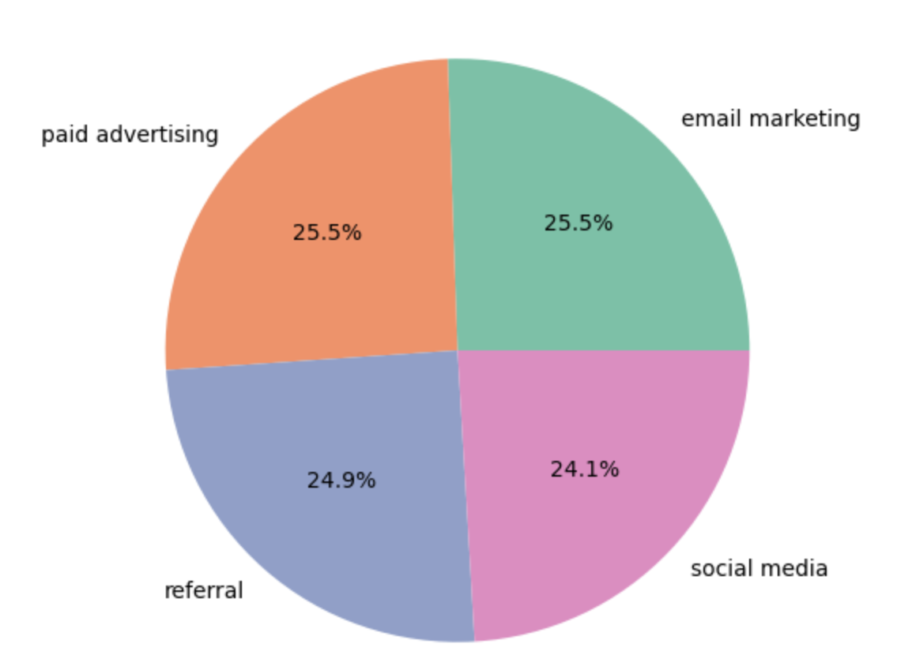
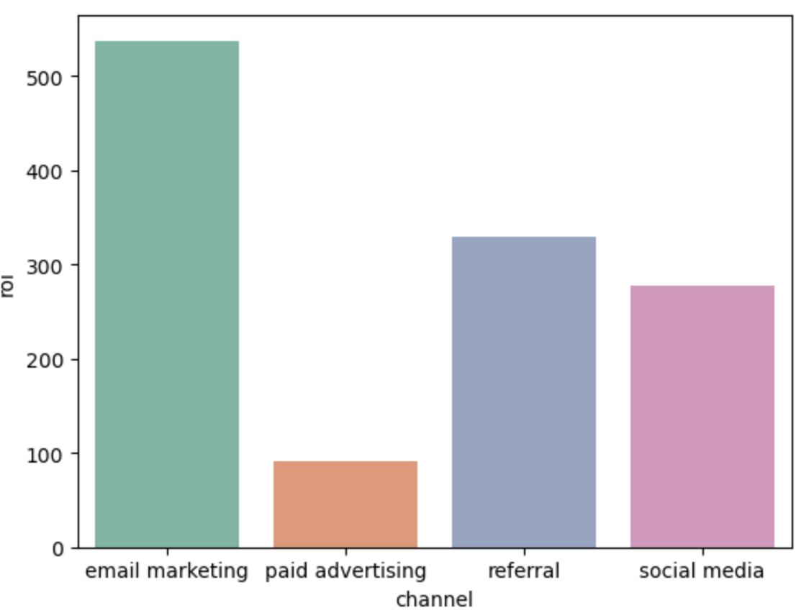
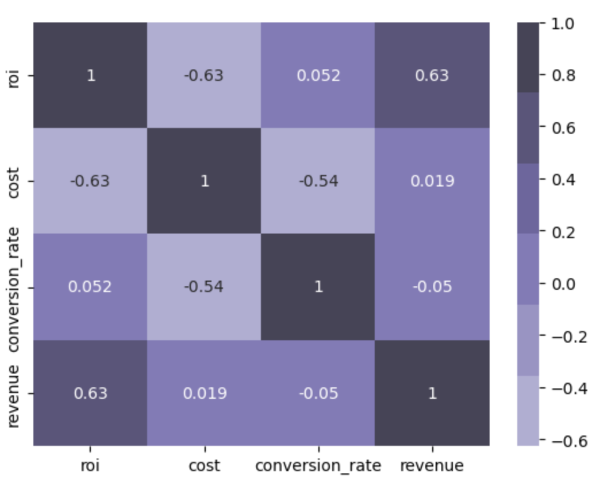

# Marketing Channel and ROI Analysis 
In today's competitive business landscape, understanding customers' behavior and optimizing customer acquisition strategies are crucial for sustainable growth. This data analysis project aims to uncover valuable insights that can inform decision-making and improve business strategies.
### Overview of the Dataset

In this step, I will start by summarizing the dataset, including its size, column names, and any missing values. I will calculate basic statistics to gain an understanding of the dataset's overall characteristics

The first five rows of the dataset

After reading and loading the dataset, I computed basic statistics for the numeric columns: 'cost', 'conversion_rate', and 'revenue'. These basic statistics give us a preliminary understanding of the dataset's characteristics and serve as a starting point for further exploration and analysis

### **Distribution of Numeric Variables**

I examined the distributions of numeric variables, such as 'cost', and 'revenue'. By visualizing these distributions, I can determine their shapes, ranges, and identify any outlier

We can see that the 'cost' variable contains 4 unique values and has a relatively balanced distribution around an average value of 200, with moderate variability.

As for the 'revenue' variable, it has been categorized into 11 bins. From it's histogram, we can conclude that this variable has a relatively narrow range and moderate variability (most observations clustered around the mean).

### **Distribution of Categorical Variables**

To understand the distribution of the categorical variable 'channel', I created a visual representation, such as bar chart. This allowed me to observe the proportions of customers acquired through different channels, identify the most common and least common channels, and assess the balance of the data

The counts for each channel appear to be relatively close to each other. This suggests that the customer acquisition efforts were distributed somewhat evenly across these channels.

### Grouping and Aggregating Data

Aggregating the data allows us to calculate summary statistics and gain insights into the average performance of different groups.

I aggregated the data by the acquisition channel to analyze the performance of each channel. For example I calculated the average 'cost', 'conversion_rate', and 'revenue' for each channel to understand which channels are most effective.

1. Average Cost per Channel

From this analysis, I observe that paid advertising has the highest average cost. On the other hand, social media, email marketing, and referrals have relatively lower average costs.

1. Average Conversation Rate Per Channel

Social media has the highest average conversion rate, indicating that it may be a more successful channel for acquiring customers who convert into revenue. Referral also has a relatively high conversion rate. Paid advertising and email marketing have the lowest average conversion rates, implying that they may require further optimization or targeting strategies to improve conversion rates.

1. Average Revenue Per Channel

The aggregation result suggests that each channel plays a significant role in generating revenue, with email marketing being the highest contributor. It implies that allocating resources and focusing efforts on these channels may be beneficial for maximizing revenue generation.

### Return on Investment (ROI)

Return on Investment (ROI) is a financial metric used to evaluate the profitability and efficiency of an investment. It measures the return or gain generated from an investment relative to its cost. I created a new column ROI using 

ROI = (Revenue - cost) / Cost

### ROI by Channel Analysis

Now I performed ROI by Channel Analysis which will allow me to assess the profitability of investments made through different acquisition channels.

Based on the analysis, email marketing appears to be the most effective channel in terms of generating returns, followed by referral and social media. Paid advertising, on the other hand, seems to have a lower ROI compared to the other channels.

### ROI and Other Variables Analysis

Performing ROI and other variables analysis can provide valuable insights into the relationship between profitability and various factors such as conversion rates, costs, and revenue

The correlation matrix suggests that cost and revenue have the strongest relationships with ROI. Higher costs are associated with lower ROI, while higher revenue is associated with higher ROI. The conversion rate alone does not show a significant correlation with ROI.

### Summary

In this data analysis project, we explored different marketing channel in relation to revenue, conversion rate and ROI 

EDA was performed to gain insights into the distribution and characteristics of the data. Various visualizations, such as histograms, bar charts, pie and box plots, heatmap were used to analyze the distribution of variables, identify patterns, and understand relationships between variables.

Aggregations, such as calculating the average cost and conversion rate, total revenue for each channel, provided an overview of how different channels contribute to overall results.

The Return on Investment (ROI) analysis helped assess the profitability and effectiveness of each channel in generating revenue.

The analysis provided valuable insights which can guide resource allocation, marketing strategies, and channel optimization efforts to maximize long-term customer value and business success
